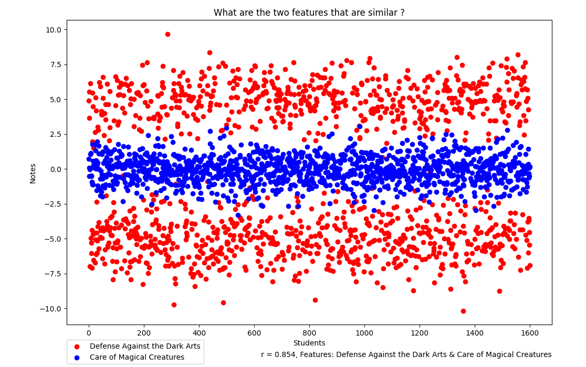
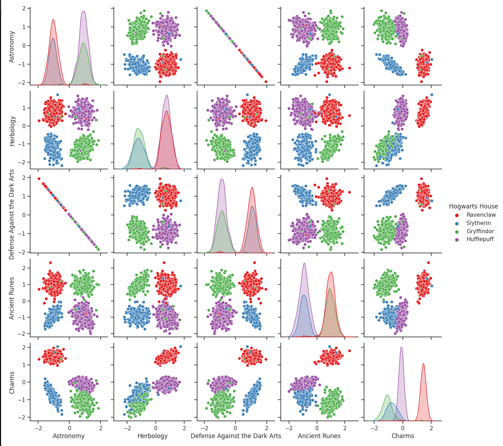

# datascience_logistic_regression
Data Analysis - Logistic Regression

# V.1 Data Analysis
- Clean Data (NaN, empty columns...)
- Calculate : Mean, std, min, max, quartiles (without using related functions)

# V.2 Data Visualization
#V.2.1 Histogram
- Clean Data
- Data Normalized
- Statistics standard deviation without mean() and std() functions but using groupby()
- Plot histogram with np.histogram()

#V.2.2 Scatter plot
- Similarities the Pearson's correlation : r = (Σ((X - X̄) * (Y - Ȳ))) / sqrt(Σ((X - X̄)^2) * Σ((Y - Ȳ)^2))
- Testing all possibilities
- Plot two correleted features
  
- 

#V.2.3 Pair plot
- pair_plot()
  

# V.3 Logistic Regression
- X (m x n) : input matrix
- θ_k (n x 1): Weight vector and b_k: a bias.
- z is the linear combination of features and weights z = θ_k^T * X + b_k.
- The logistic or sigmoid function activation function, given by:
  σ(z) = 1 / (1 + e^(-z))
- L(θ_k, b_k) = - (1/m) * Σ[y * log(σ(z)) + (1 - y) * log(1 - σ(z))] : The loss function for binary logistic
  regression is the cross-entropy loss.
- ∂L / ∂θ_k = (1/m) * Σ[(σ(z) - y) * X] : Gradient with respect to weights (θ_k). (σ(z) - y) is the difference between the predicted probability and the true target value for class k.
- ∂L / ∂b_k = (1/m) * Σ(σ(z) - y) : Gradient with respect to bias (b_k).

1-Data Preparation:

2-Feature Scaling

#3 - Logistic Regression Model: P(y=1|x) = 1 / (1 + exp(-z))
    - P(y=1|x) is the probability that the student belongs to Team 1.
    - z is the linear combination of features and their corresponding coefficients: z = θ0 + θ1*x1 + θ2*x2 + ... + θn*xn
    
#4 Cost Function : J(θ) = -1/m * Σ [ y*log(P) + (1-y)*log(1-P) ]

#5 Gradient Descent : gradient descent to minimize the cost function and find the optimal coefficients (θ values).
      θi = θi - α * ∂J(θ)/∂θi
      
#6 Training

#7 Prediction

      

